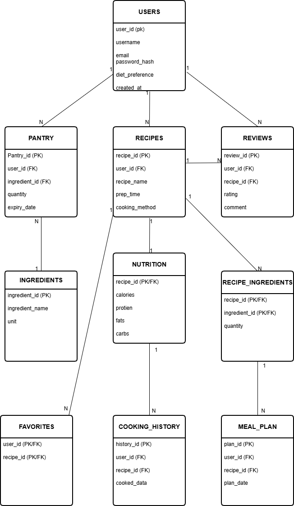

# 🍽️ Recipe Manager DBMS Project

## 📌 Overview
This project is a fully normalized SQL-based database system designed to manage recipes, ingredients, pantry, and meal planning efficiently.

It demonstrates real-world DBMS concepts including relationships, constraints, triggers, and stored procedures.

---

## 🎯 Features
- User management system
- Recipe creation and categorization
- Ingredient tracking
- Pantry management with expiry alerts
- Meal planning system
- Cooking history tracking
- Reviews & ratings
- Favorites system

---

## ⚙️ Advanced Concepts Used
- Normalization (1NF, 2NF, 3NF)
- Triggers (automation)
- Stored Procedures
- Joins & Subqueries
- Constraints (Primary Key, Foreign Key, UNIQUE, CHECK)

---

## 🔥 Key Functionalities
- Suggest recipes based on available pantry ingredients
- Automatically update pantry after cooking
- Generate weekly meal plans
- Identify trending recipes
- Notify users about expiring ingredients

---

## 🛠️ Tech Stack
- MySQL
- SQL

---

## 🗂️ ER Diagram

---

## 📁 Project Structure
- schema.sql → Database structure
- sample_data.sql → Sample data
- queries.sql → SQL queries
- triggers_procedures.sql → Triggers & procedures

---

  ## 📊 Project Presentation

📂 Download the complete project presentation:  
👉 [Recipe Manager PPT](./Recipe_Manager_Presentation.pptx)

---

## 🚀 How to Run
1. Run schema.sql  
2. Run sample_data.sql  
3. Run triggers_procedures.sql  
4. Run queries.sql  

---

## 📌 Future Improvements
- Add frontend (Java / Web)
- API integration
- Recommendation system using Machine Learning

---

## 👨‍💻 Author

**Mohd Younus Ahmed**

Cybersecurity Enthusiast and Backend Developer with a strong foundation in Java and Database Management Systems. Passionate about building secure, scalable, and efficient applications.

### 🚀 Skills & Focus Areas
- Java Development  
- Object-Oriented Programming (OOP)  
- Backend Development  
- SQL & DBMS  
- Cybersecurity Fundamentals  

🔗 GitHub: https://github.com/ahmed07x-1
